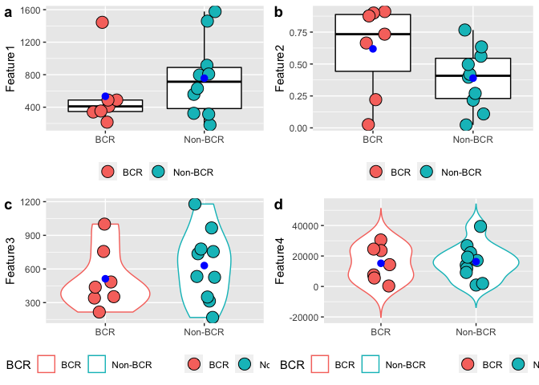

Please visit the following link for more information.
<http://www.sthda.com/english/wiki/ggplot2-box-plot-quick-start-guide-r-software-and-data-visualization>
<br>

readxl -\> reading an xlsx file <br> ggplot2 -\> generating plots <br>
cowplot -\> drawing multiple plots on a grid <br>

``` r
library(readxl)
library(ggplot2)
library(cowplot)
```

Read the data from excel file.

``` r
data <- read_excel("data.xlsx")
data$BCR <- as.factor(data$BCR)
```

``` r
xName = 'BCR'
pointSize = 5
legendPosition = "bottom"
legendTitle = ""
pch = 21
jitter = 0.5
meanDotColor = "blue"
```

Generate four box plots each of which will use one feature in the xlsx
file. You can easily change the plot type by changing the
**geom\_boxplot** command such as geom\_violin.

``` r
p1 <- ggplot(data, aes(x=BCR, y=ft1, color=BCR)) + geom_boxplot(color='black') + theme(legend.position = legendPosition, axis.title.x=element_blank()) + labs(y = "Feature1", fill = legendTitle) + geom_point(aes(fill=BCR), size = pointSize, pch=pch, position = position_jitterdodge(jitter), color='black') + stat_summary(fun=mean, color=meanDotColor)

p2 <- ggplot(data, aes(x=BCR, y=ft2, color=BCR)) + geom_boxplot(color='black') + theme(legend.position = legendPosition, axis.title.x=element_blank()) + labs(y = "Feature2", fill = legendTitle) + geom_point(aes(fill=BCR), size = pointSize, pch=pch, position = position_jitterdodge(jitter), color='black') + stat_summary(fun=mean, color=meanDotColor)

p3 <- ggplot(data, aes(x=BCR, y=ft3, color=BCR)) + geom_violin() + theme(legend.position = legendPosition, axis.title.x=element_blank()) + labs(y = "Feature3", fill = legendTitle) + geom_point(aes(fill=BCR), size = pointSize, pch=pch, position = position_jitterdodge(jitter), color='black') + stat_summary(fun=mean, color=meanDotColor)

p4 <- ggplot(data, aes(x=BCR, y=ft4, color=BCR)) + geom_violin(trim = FALSE) + theme(legend.position = legendPosition, axis.title.x=element_blank()) + labs(y = "Feature4", fill = legendTitle) + geom_point(aes(fill=BCR), size = pointSize, pch=pch, position = position_jitterdodge(jitter), color='black') + stat_summary(fun=mean, color=meanDotColor)
```

Show the generated plots on a 2x2 grid.

``` r
cowplot::plot_grid(p1, p2, p3, p4, nrow=2, labels = "auto")
```

    ## Warning: Removed 2 rows containing missing values (geom_segment).
    
    ## Warning: Removed 2 rows containing missing values (geom_segment).
    
    ## Warning: Removed 2 rows containing missing values (geom_segment).
    
    ## Warning: Removed 2 rows containing missing values (geom_segment).

<!-- -->
